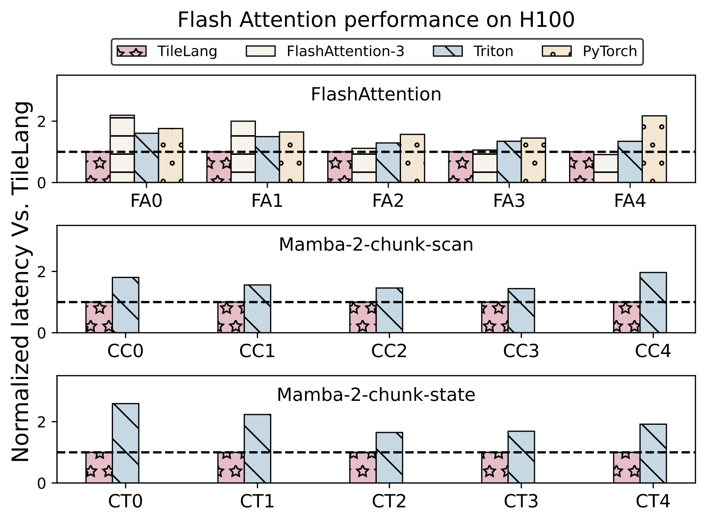
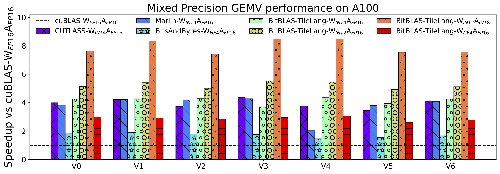

<div align="center">

# Tile Language

</div>

Tile Language (**tile-lang**) is a concise domain-specific language designed to streamline the development of high-performance GPU/CPU kernels (e.g., GEMM, Dequant GEMM, FlashAttention, LinearAttention). By employing a Pythonic syntax with an underlying compiler infrastructure on top of [TVM](https://tvm.apache.org/), tile-lang allows developers to focus on productivity without sacrificing the low-level optimizations necessary for state-of-the-art performance.


## Latest News
- 03/03/2025 🚀: Added high-performance MLA Decoding support using only 80 lines of Python code, achieving performance on par with FlashMLA on H100 (see [example_mla_decode.py](./examples/deepseek_mla/example_mla_decode.py))! We also provide [documentation](./examples/deepseek_mla/README.md) explaining how TileLang achieves this.
- 02/15/2025 ✨: Added WebGPU Codegen support, see [Pull Request #86](https://github.com/tile-ai/tilelang/pull/86)!
- 02/12/2025 ✨: Excited to announce the release of [v0.1.0](https://github.com/tile-ai/tilelang/releases/tag/v0.1.0)!
- 02/10/2025 🚀: Added debug tools for TileLang—`T.print` for printing variables/buffers ([docs](https://tilelang.tile-ai.cn/tutorials/debug_tools_for_tilelang.html)) and a memory layout plotter ([examples/plot_layout](./examples/plot_layout)).
- 01/20/2025 ✨: We are excited to announce that tile-lang, a dsl for high performance AI workloads, is now open source and available to the public!

## Tested Devices
Although tile-lang aims to be portable across a range of Devices, it has been specifically tested and validated on the following devices: for NVIDIA GPUs, this includes the H100 (with Auto TMA/WGMMA support), A100, V100, RTX 4090, RTX 3090, and RTX A6000; for AMD GPUs, it includes the MI250 (with Auto MatrixCore support) and the MI300X (with Async Copy support).

## OP Implementation Examples
**tile-lang** provides the building blocks to implement a wide variety of operators. Some examples include:

- [Matrix Multiplication](./examples/gemm/)
- [Dequantization GEMM](./examples/dequantize_gemm/)
- [Flash Attention](./examples/flash_attention/)
- [Flash Linear Attention](./examples/linear_attention/)
- [Flash MLA Decoding](./examples/deepseek_mla/)
- [Native Sparse Attention](./examples/native_sparse_attention/)

Within the `examples` directory, you will also find additional complex kernels—such as convolutions, forward/backward passes for FlashAttention, more operators will continuously be added.


## Benchmark Summary

TileLang achieves exceptional performance across a variety of computational patterns. Comprehensive benchmark scripts and settings are available at [tilelang-benchmark](https://github.com/tile-ai/tilelang-benchmark). Below are selected results showcasing its capabilities:

- MLA Decoding Performance on H100

  <div style="display: flex; gap: 10px; justify-content: center;">
    <div style="flex: 1;">
      
    </div>
    <div style="flex: 1;">
      
    </div>
  </div>
  
- Flash Attention Performance on H100

  <div align="center">    
  </div>

- Matmul Performance on GPUs (RTX 4090, A100, H100, MI300X)

  <div>
    
  </div>

- Dequantize Matmul Performance on A100

  <div>
    
  </div>

## Installation
### Method 1: Install with Pip

The quickest way to get started is to install the latest release from PyPI:

```bash
pip install tilelang
```

Alternatively, you can install directly from the GitHub repository:

```bash
pip install git+https://github.com/tile-ai/tilelang
```

Or install locally:

```bash
# install required system dependencies
sudo apt-get update
sudo apt-get install -y python3-setuptools gcc libtinfo-dev zlib1g-dev build-essential cmake libedit-dev libxml2-dev

pip install .  # with -e option if you want to install in editable mode
```

### Method 2: Build from Source
We currently provide three ways to install **tile-lang** from source:
 - [Install from Source (using your own TVM installation)](./docs/get_started/Installation.md#method-1-install-from-source-using-your-own-tvm-installation)
 - [Install from Source (using the bundled TVM submodule)](./docs/get_started/Installation.md#method-2-install-from-source-using-the-bundled-tvm-submodule)
 - [Install Using the Provided Script](./docs/get_started/Installation.md#method-3-install-using-the-provided-script)


## Quick Start

In this section, you'll learn how to write and execute a straightforward GEMM (matrix multiplication) kernel using tile-lang, followed by techniques for layout optimizations, pipelining, and L2-cache–friendly swizzling.

### GEMM Example with Annotations (Layout, L2 Cache Swizzling, and Pipelining, etc.)

Below is an example that demonstrates more advanced features: layout annotation, parallelized copy, and swizzle for improved L2 cache locality. This snippet shows how to adapt your kernel to maximize performance on complex hardware.

```python
import tilelang
import tilelang.language as T
# `make_mma_swizzle_layout` is a python defined layout function
# specifically designed for for MMA operations
# which ensures the consistency with the nvidia CUTLASS Library.
# to avoid bank conflicts and maximize the performance.
from tilelang.intrinsics import (
    make_mma_swizzle_layout as make_swizzle_layout,)

def matmul(M, N, K, block_M, block_N, block_K, dtype="float16", accum_dtype="float"):
    # add decorator @tilelang.jit if you want to return a torch function
    @T.prim_func
    def main(
        A: T.Buffer((M, K), dtype),
        B: T.Buffer((K, N), dtype),
        C: T.Buffer((M, N), dtype),
    ):
        # Initialize Kernel Context
        with T.Kernel(T.ceildiv(N, block_N), T.ceildiv(M, block_M), threads=128) as (bx, by):
            A_shared = T.alloc_shared((block_M, block_K), dtype)
            B_shared = T.alloc_shared((block_K, block_N), dtype)
            C_local  = T.alloc_fragment((block_M, block_N), accum_dtype)

            # Apply layout optimizations or define your own layout (Optional)
            # If not specified, we will deduce the layout automatically
            # T.annotate_layout({
            #     A_shared: make_swizzle_layout(A_shared),
            #     B_shared: make_swizzle_layout(B_shared),
            # })

            # Enable rasterization for better L2 cache locality (Optional)
            # T.use_swizzle(panel_size=10, enable=True)

            # Clear local accumulation
            T.clear(C_local)

            for ko in T.Pipelined(T.ceildiv(K, block_K), num_stages=3):
                # Copy tile of A
                # This is a sugar syntax for parallelized copy
                T.copy(A[by * block_M, ko * block_K], A_shared)

                # Demonstrate parallelized copy from global to shared for B
                for k, j in T.Parallel(block_K, block_N):
                    B_shared[k, j] = B[ko * block_K + k, bx * block_N + j]

                # Perform a tile-level GEMM on the shared buffers
                # Currently we dispatch to the cute/hip on Nvidia/AMD GPUs
                T.gemm(A_shared, B_shared, C_local)

            # Copy result back to global memory
            T.copy(C_local, C[by * block_M, bx * block_N])

    return main


# 1. Define the kernel (matmul) with the desired dimensions
func = matmul(1024, 1024, 1024, 128, 128, 32)

# 2. Compile the kernel into a torch function
# out_idx specifies the index of the output buffer in the argument list
# if out_idx is specified, the tensor will be created during runtime
# target currently can be "cuda" or "hip" or "cpu".
jit_kernel = tilelang.compile(func, out_idx=[2], target="cuda")

# 3. Test the kernel in Python with PyTorch data
import torch

# Create random input tensors on the GPU
a = torch.randn(1024, 1024, device="cuda", dtype=torch.float16)
b = torch.randn(1024, 1024, device="cuda", dtype=torch.float16)


# Run the kernel through the JIT-compiled function
c = jit_kernel(a, b)

# Reference multiplication using PyTorch
ref_c = a @ b

# Validate correctness
torch.testing.assert_close(c, ref_c, rtol=1e-2, atol=1e-2)
print("Kernel output matches PyTorch reference.")

# 4. Retrieve and inspect the generated CUDA source (optional)
cuda_source = jit_kernel.get_kernel_source()
print("Generated CUDA kernel:\n", cuda_source)

# 5.Pofile latency with the profiler
profiler = jit_kernel.get_profiler()

latency = profiler.do_bench()

print(f"Latency: {latency} ms")
```

### Dive Deep into TileLang Beyond GEMM

In addition to GEMM, we provide a variety of examples to showcase the versatility and power of TileLang, including:

- [Dequantize GEMM](./examples/dequantize_gemm/): Achieve high-performance dequantization by **fine-grained control over per-thread operations**, with many features now adopted as default behaviors in [BitBLAS](https://github.com/microsoft/BitBLAS), which utilizing magic layout transformation and intrins to accelerate dequantize gemm.
- [FlashAttention](./examples/flash_attention/): Enable cross-operator fusion with simple and intuitive syntax, and we also provide an example of auto tuning.
- [LinearAttention](./examples/linear_attention/): Examples include RetNet and Mamba implementations.
- [Convolution](./examples/convolution/): Implementations of Convolution with IM2Col.

## Upcoming Features

Check our [tilelang v0.2.0 release plan](https://github.com/tile-ai/tilelang/issues/79) for upcoming features.

---

TileLang has now been used in project [BitBLAS](https://github.com/microsoft/BitBLAS) and [AttentionEngine](https://github.com/microsoft/AttentionEngine).

## Join the Discussion

Welcome to join our Discord community for discussions, support, and collaboration!

[](https://discord.gg/TUrHyJnKPG)

## Acknowledgements

We would like to express our gratitude to the [TVM](https://github.com/apache/tvm) community for their invaluable contributions. The initial version of this project was mainly developed by [LeiWang1999](https://github.com/LeiWang1999), [chengyupku](https://github.com/chengyupku) and [nox-410](https://github.com/nox-410) with supervision from Prof. [Zhi Yang](https://yangzhihome.github.io) at Peking University. Part of this work was carried out during an internship at Microsoft Research, where Dr. Lingxiao Ma, Dr. Yuqing Xia, Dr. Jilong Xue, and Dr. Fan Yang offered valuable advice and support. We deeply appreciate their mentorship and contributions.
