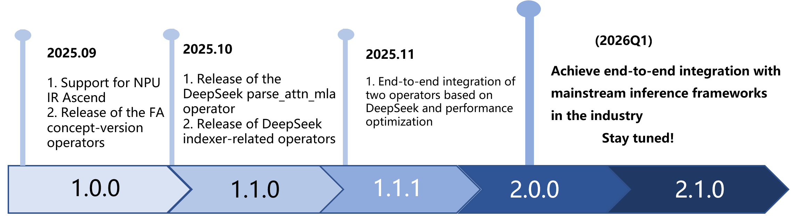

<div align="center">

# Tile Language for Ascend

</div>

<!-- Tile Language (**tile-lang**) is a concise domain-specific language designed to streamline the development of high-performance GPU/CPU kernels (e.g., GEMM, Dequant GEMM, FlashAttention, LinearAttention). By employing a Pythonic syntax with an underlying compiler infrastructure on top of [TVM](https://tvm.apache.org/), tile-lang allows developers to focus on productivity without sacrificing the low-level optimizations necessary for state-of-the-art performance. -->
<!-- TileLang for Ascend 是 Tile Language（tile-lang）在昇腾（Ascend）AI处理器上的深度适配与扩展。作为一套简洁高效的领域特定语言，TileLang 原生支持以类 Python 语法编写高性能计算核函数（如 GEMM、Dequant GEMM、FlashAttention、LinearAttention 等），并依托 TVM 与 MLIR 构建强大的编译基础设施。

在 TileLang 生态中，我们构建了面向 Ascend 的 NPU 中间表示（NPUIR）基础设施，使其能够无缝融入基于 MLIR 的开源 AI 编译器生态。这一举措不仅提升了编译栈的开放性与可扩展性，也为开发者提供了更灵活、高效的算子开发路径。 -->
TileLang for Ascend is a deep adaptation and extension of Tile Language (tile-lang) tailored for the Ascend AI processor. As a concise and efficient domain-specific language, TileLang natively supports writing high-performance compute kernels—such as GEMM, Dequantized GEMM, FlashAttention, and LinearAttention—using Python-like syntax, and leverages TVM and MLIR to build a robust compiler infrastructure.

Within the TileLang ecosystem, we have developed an NPU Intermediate Representation (NPUIR) infrastructure specifically for Ascend, enabling seamless integration into the open-source AI compiler ecosystem based on MLIR. This effort not only enhances the openness and extensibility of the compiler stack but also provides developers with a more flexible and efficient pathway for custom operator development.

<!-- ascend NPU IR技术路线 for tilelang -->


<div align="center">

</div>


## Latest News
- 26/09/2025 🚀: Officially establish the NPU Intermediate Representation (NPUIR) infrastructure for Ascend within the TileLang ecosystem, deeply integrating into the open-source AI compiler ecosystem based on MLIR. At the same time, deliver peak performance—fusion operators such as FlashAttention (FA) written in TileLang achieve performance on Ascend hardware that matches hand-written AscendC equivalents at a 1.0x level, balancing both development efficiency and ultimate performance!
<!-- - 在 TileLang 生态中正式构建面向昇腾（Ascend）的 NPU 中间表示（NPUIR）基础设施，深度融入基于 MLIR 的开源 AI 编译器生态；同时释放极致性能——使用 TileLang 编写的 FlashAttention（FA）等融合算子，在昇腾硬件上性能达到 AscendC 手写等价算子的 1.0x 水平，兼顾开发效率与极致性能！ -->
- 14/04/2025 🚀: Added high-performance FlashMLA implementation for AMD MI300X, achieving performance parity with hand-optimized assembly kernels of Aiter! See [example_mla_amd](./examples/deepseek_mla/amd/README.md) for details.
- 03/03/2025 🚀: Added high-performance MLA Decoding support using only 80 lines of Python code, achieving performance on par with FlashMLA on H100 (see [example_mla_decode.py](./examples/deepseek_mla/example_mla_decode.py))! We also provide [documentation](./examples/deepseek_mla/README.md) explaining how TileLang achieves this.
- 02/15/2025 ✨: Added WebGPU Codegen support, see [Pull Request #86](https://github.com/tile-ai/tilelang/pull/86)!
- 02/12/2025 ✨: Excited to announce the release of [v0.1.0](https://github.com/tile-ai/tilelang/releases/tag/v0.1.0)!
- 02/10/2025 🚀: Added debug tools for TileLang—`T.print` for printing variables/buffers ([docs](https://tilelang.com/tutorials/debug_tools_for_tilelang.html)) and a memory layout plotter ([examples/plot_layout](./examples/plot_layout)).
- 01/20/2025 ✨: We are excited to announce that tile-lang, a dsl for high performance AI workloads, is now open source and available to the public!

## Tested Devices
<!-- Although tile-lang aims to be portable across a range of Devices, it has been specifically tested and validated on the following devices: for NVIDIA GPUs, this includes the H100 (with Auto TMA/WGMMA support), A100, V100, RTX 4090, RTX 3090, and RTX A6000; for AMD GPUs, it includes the MI250 (with Auto MatrixCore support) and the MI300X (with Async Copy support). -->
<!-- 尽管 TileLang 旨在支持多种设备的可移植性，但它已在以下设备上经过专门测试和验证：

华为昇腾 AI 加速卡：包括基于 Ascend 310 的推理卡和基于 Ascend 910 的训练卡。 -->
Although TileLang aims to support portability across a variety of devices, it has been specifically tested and validated on the following hardware:Huawei Ascend AI accelerators,including Ascend 310-based inference cards and Ascend 910-based training cards.


## OP Implementation Examples
**tile-lang** provides the building blocks to implement a wide variety of operators. Some examples include:

- [Vector Add](./docs/tutorials/vec_add_tutorials.md)
- [Matrix Multiplication](./examples/gemm/)
- [Dequantization GEMM](./examples/dequantize_gemm/)
- [Flash Attention](./examples/flash_attention/)
- [Flash Linear Attention](./examples/linear_attention/)
- [Flash MLA Decoding](./examples/deepseek_mla/)
- [Native Sparse Attention](./examples/native_sparse_attention/)

Within the `examples` directory, you will also find additional complex kernels—such as convolutions, forward/backward passes for FlashAttention, more operators will continuously be added.


## Benchmark Summary

TileLang achieves exceptional performance across a variety of computational patterns. Comprehensive benchmark scripts and settings are available at [tilelang-benchmark](https://github.com/tile-ai/tilelang-benchmark). Below are selected results showcasing its capabilities:

- MLA Decoding Performance on H100

  <div style="display: flex; gap: 10px; justify-content: center;">
    <div style="flex: 1;">
      
    </div>
    <div style="flex: 1;">
      
    </div>
  </div>
  
- Flash Attention Performance on H100

  <div align="center">    
  </div>

- Matmul Performance on GPUs (RTX 4090, A100, H100, MI300X)

  <div>
    
  </div>

- Dequantize Matmul Performance on A100

  <div>
    
  </div>

## Installation
### Method 1: Install from source
### Environment Setup

Install the Ascend Toolkit.
<!-- #### 环境准备

准备Ascend-toolkit -->


<!-- [下载安装包](https://www.hiascend.com/developer/download/community/result?cann=8.3.RC1.alpha002)，安装`Ascend-cann-toolkit`。完整安装步骤参考[相关文档](https://www.hiascend.com/document/detail/zh/CANNCommunityEdition/83RC1alpha002/softwareinst/instg/instg_0008.html?Mode=PmIns&OS=Debian&Software=cannToolKit)。 -->

[Download the installation package](https://www.hiascend.com/developer/download/community/result?cann=8.3.RC1.alpha002)，install`Ascend-cann-toolkit`.For complete installation instructions, refer to the [relevant documentation](https://www.hiascend.com/document/detail/zh/CANNCommunityEdition/83RC1alpha002/softwareinst/instg/instg_0008.html?Mode=PmIns&OS=Debian&Software=cannToolKit).

```shell
chmod +x Ascend-cann-toolkit_{ascend-cann-toolkit version}_linux-aarch64.run
./Ascend-cann-toolkit_{ascend-cann-toolkit version}_linux-aarch64.run --install
```

<!-- 配置环境变量： -->
Configure environment variables:

```
source /path/to/install/Ascend/ascend-toolkit/set_env.sh
```

<!-- 准备python环境，满足Python版本为3.7.*x*至3.11.4，且具有pip3 -->
Prepare a Python environment with Python version between 3.7.*x* and 3.11.4 (inclusive) and ensure that `pip3` is available.


   Ascend Toolkit Installation Requirements

   ```shell
   pip3 install attrs cython 'numpy>=1.19.2,<=1.24.0' decorator sympy cffi pyyaml pathlib2 psutil protobuf==3.20.0 scipy requests absl-py
   ```

<!-- 部署Bisheng编译器: -->
Deploy the Bisheng compiler:


   ```shell
   export BISHENG_INSTALL_PATH=/path/to/bishengir-compile
   ```
   <!-- 补充环境变量设置 -->
   Set Environment Variables

```shell
export ACL_OP_INIT_MODE=1
```
  <!-- 注意：如果用户需要新的编译器安装包，请联系社区管理员zhaojiqiao@huawei.com,yangsichan@huawei.com TEL:15901269653 -->

  Note: If you require a new compiler installation package, please contact the community administrators:  
**zhaojiqiao@huawei.com**, **yangsichan@huawei.com**  


   

#### Build

<!-- 拉取代码 -->
Pull the code

```shell
git clone https://github.com/xxxx/tilelang-npu.git
```

<!-- 执行安装脚本 -->
Run the installation script

```shell
cd tilelang-npu
chmod +x ./install_npuir.sh
./install_npuir.sh
```

Install torch_npu

```shell
pip install pybind11 torch_npu
```


<!-- ### Method 1: Install with Pip

The quickest way to get started is to install the latest release from PyPI:

```bash
pip install tilelang
```

Alternatively, you can install directly from the GitHub repository:

```bash
pip install git+https://github.com/tile-ai/tilelang
```

Or install locally:

```bash
# install required system dependencies
sudo apt-get update
sudo apt-get install -y python3-setuptools gcc libtinfo-dev zlib1g-dev build-essential cmake libedit-dev libxml2-dev

pip install -e . -v # remove -e option if you don't want to install in editable mode, -v for verbose output
```

### Method 2: Build from Source
We currently provide three ways to install **tile-lang** from source:
 - [Install from Source (using your own TVM installation)](./docs/get_started/Installation.md#method-1-install-from-source-using-your-own-tvm-installation)
 - [Install from Source (using the bundled TVM submodule)](./docs/get_started/Installation.md#method-2-install-from-source-using-the-bundled-tvm-submodule)
 - [Install Using the Provided Script](./docs/get_started/Installation.md#method-3-install-using-the-provided-script)

### Method 3: Install with Nightly Version

For users who want access to the latest features and improvements before official releases, we provide nightly builds of **tile-lang**.

```bash
pip install tilelang -f https://tile-ai.github.io/whl/nightly/cu121/
# or pip install tilelang --find-links https://tile-ai.github.io/whl/nightly/cu121/
``` -->

<!-- > **Note:** Nightly builds contain the most recent code changes but may be less stable than official releases. They're ideal for testing new features or if you need a specific bugfix that hasn't been released yet. -->

## Quick Start

This code implements a vector addition kernel using TileLang, a domain-specific language for NPU (Neural Processing Unit) programming. It defines a parallel kernel that adds two float32 vectors of length 4096 on the NPU by loading data into on-chip unified buffers, performing element-wise addition via a low-level NPU instruction (`npuir_add`), and writing the result back to global memory. The test function compares the kernel’s output against PyTorch’s native vector addition to verify correctness. The example runs on NPU device 6 and demonstrates basic TileLang workflow: kernel definition, compilation to NPU IR, and execution with PyTorch tensors.

```python
# Copyright (c) Tile-AI Corporation.
# Licensed under the MIT License.

import os

import tilelang
import tilelang.language as T  # Import TileLang DSL for kernel definition

import torch
import torch_npu  # Import NPU (Neural Processing Unit) backend support for PyTorch

# Clear any previously cached compiled kernels to ensure a clean run
tilelang.cache.clear_cache()

# Define data type and sequence length for the vector addition
dtype = "float32"
seq_len = 4096  # Length of the vectors to be added

def vec_add(N, block_N, dtype="float32"):
    """
    Define a vector addition kernel using TileLang.
    
    Parameters:
    - N: Total length of the vectors.
    - block_N: Number of elements processed per kernel thread/block.
    - dtype: Data type of the tensors (default: "float32").
    
    Returns:
    - A TileLang prim_func representing the vector addition kernel.
    """
    n_num = N // block_N  # Number of blocks (each block processes `block_N` elements)

    @T.prim_func
    def main(
        A: T.Tensor((N), dtype),  # Input tensor A
        B: T.Tensor((N), dtype),  # Input tensor B
        C: T.Tensor((N), dtype),  # Output tensor C = A + B
        shape: T.int32,           # Actual size (used for handling tail cases if N is not divisible by block_N)
    ):
        # Launch kernel with `n_num` parallel threads on the NPU
        with T.Kernel(n_num, is_npu=True) as (cid, _):
            # Allocate on-chip Unified Buffer (UB) for local computation
            A_VEC = T.alloc_ub((block_N), dtype)
            B_VEC = T.alloc_ub((block_N), dtype)
            C_VEC = T.alloc_ub((block_N), dtype)

            # Calculate the starting index for this thread
            start_idx = cid * block_N
            # Compute remaining elements from this start index to the end of the tensor
            remaining = shape - start_idx
            # Determine how many elements this thread should actually process (handles tail)
            tail_size = T.min(block_N, remaining)

            # Copy data from global memory (A, B) into on-chip buffers (A_VEC, B_VEC)
            T.copy(A[start_idx], A_VEC, [tail_size])
            T.copy(B[start_idx], B_VEC, [tail_size])

            # Perform vector addition on the NPU using low-level NPU IR instruction
            T.npuir_add(A_VEC, B_VEC, C_VEC)

            # Write the result back from on-chip buffer (C_VEC) to global memory (C)
            T.copy(C_VEC, C[start_idx], [tail_size])

    return main

def test_vec_add():
    """
    Test function to validate the vector addition kernel.
    Compares the result of the custom TileLang kernel against PyTorch's native addition.
    """
    # Set the target NPU device (device ID 6 in this case)
    torch.npu.set_device(6)

    # Instantiate the vector addition kernel for the full sequence length (single block)
    func = vec_add(seq_len, seq_len)

    # Compile the TileLang function to NPU IR for execution on the NPU
    compiled_kernel = tilelang.compile(func, target="npuir")

    # Create random input tensors on the NPU
    v1 = torch.randn(size=[seq_len], dtype=eval("torch." + dtype)).npu()
    v2 = torch.randn(size=[seq_len], dtype=eval("torch." + dtype)).npu()
    v3 = torch.zeros(size=[seq_len], dtype=eval("torch." + dtype)).npu()  # Output buffer

    # Compute reference result using PyTorch's native addition (on NPU)
    y_ref = v1 + v2

    # Launch the compiled TileLang kernel
    compiled_kernel(v1, v2, v3, seq_len)

    # Print both results for visual comparison (should be nearly identical)
    print("Reference result (PyTorch):")
    print(y_ref)
    print("TileLang kernel result:")
    print(v3)

if __name__ == "__main__":
    test_vec_add()
  ```

<!-- ### Dive Deep into TileLang Beyond GEMM

In addition to GEMM, we provide a variety of examples to showcase the versatility and power of TileLang, including:

- [Dequantize GEMM](./examples/dequantize_gemm/): Achieve high-performance dequantization by **fine-grained control over per-thread operations**, with many features now adopted as default behaviors in [BitBLAS](https://github.com/microsoft/BitBLAS), which utilizing magic layout transformation and intrins to accelerate dequantize gemm.
- [FlashAttention](./examples/flash_attention/): Enable cross-operator fusion with simple and intuitive syntax, and we also provide an example of auto tuning.
- [LinearAttention](./examples/linear_attention/): Examples include RetNet and Mamba implementations.
- [Convolution](./examples/convolution/): Implementations of Convolution with IM2Col. -->

## Roadmap
<!-- <div align="center"> -->


<!-- 
Check our [tilelang v0.2.0 release plan](https://github.com/tile-ai/tilelang/issues/79) for upcoming features.

---

TileLang has now been used in project [BitBLAS](https://github.com/microsoft/BitBLAS) and [AttentionEngine](https://github.com/microsoft/AttentionEngine). -->

## Join the Discussion

Welcome to join our Discord community for discussions, support, and collaboration!

[](https://discord.gg/TUrHyJnKPG)

## Acknowledgements

Peking University Kunpeng & Ascend Center for Excellence in Science, Education, Innovation

