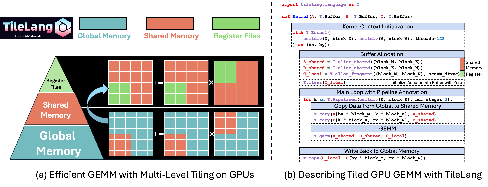
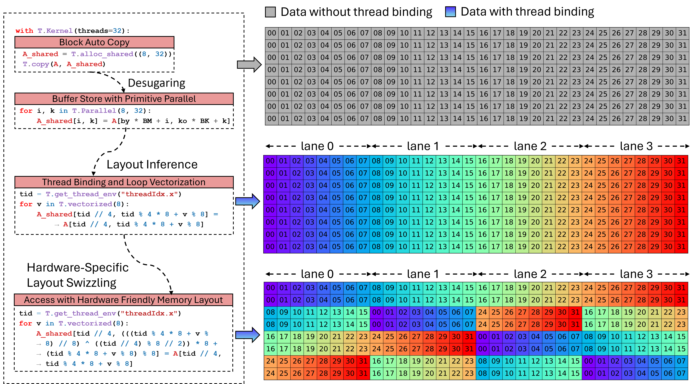

The Tile Language: A Brief Introduction
===============================

.. _sec-overview:

Programming Interface
---------------------

The figure below depicts how **TileLang** programs are progressively lowered from a high-level description to hardware-specific executables. We provide three different programming interfaces—targeted at **Beginner**, **Developer**, and **Expert** users—that each reside at different levels in this lowering pipeline. The **Tile Language** also allows mixing these interfaces within the same kernel, enabling users to work at whichever level of abstraction best suits their needs.

.. _fig-overview:

.. figure:: ../_static/img/overview.png
   :align: center
   :width: 50%
   :alt: Overview

   High-level overview of the TileLang compilation flow.

Programming Interfaces
----------------------

1. **Beginner Level (Hardware-Unaware)**
   - Intended for users who need to write code that is independent of specific hardware details.  
   - The goal is to let developers focus on the basic logic without worrying about memory hierarchies or hardware-specific optimizations.  
   - *Note:* This interface is not yet fully implemented.

2. **Developer Level (Hardware-Aware with Tile Library)**
   - Designed for developers who have a basic understanding of GPU memory hierarchies and performance considerations.  
   - Provides a **Tile Library**, containing predefined operations and patterns optimized for various hardware architectures.  
   - Users at this level can leverage these ready-made primitives without diving into low-level threading details.

3. **Expert Level (Hardware-Aware with Thread Primitives)**
   - For highly experienced users who have an in-depth understanding of low-level hardware characteristics (e.g., threading models, memory coalescing).  
   - Offers direct access to **thread primitives** and other low-level constructs, allowing for fine-grained control of performance-critical kernels.  
   - This level grants maximum flexibility for specialized optimizations tailored to specific GPU or multi-core architectures.

Compilation Flow
----------------

1. **Tile Program**  
   A high-level specification of the computation. Depending on the user’s expertise, they may write a purely hardware-unaware tile program or incorporate constructs from the Tile Library or thread primitives.

2. **Tile Program with Tile Library**  
   When developers choose from the Tile Library, the original Tile Program is expanded with specialized library calls. These calls encapsulate efficient implementation patterns for different operations.

3. **Tile Program with Thread Primitives**  
   Expert-level developers can explicitly use low-level threading constructs to hand-optimize data layout, synchronization, and memory usage.

4. **IRModule**  
   After the program is composed with libraries or thread primitives, it is lowered to an intermediate representation (IR) that captures the necessary hardware details.

5. **Source Code Generation (C/CUDA/HIP/LLVM/…)**  
   From the IR, the system generates target-specific source code. This source code is tuned for the desired backends or GPU architectures (e.g., NVIDIA, AMD).

6. **Hardware-Specific Executable/Runtime**  
   Finally, the generated source is compiled into hardware-specific executables, ready to run on the corresponding devices. The pipeline supports multiple GPU backends and can be extended to additional architectures.

.. _sec-tile_based_programming_model:

Tile-based Programming Model
----------------------------

Figure :ref:`fig-matmul_example` provides a concise matrix multiplication (GEMM) example in ``TileLang``, 
illustrating how developers can employ high-level constructs such as tiles, memory placement, pipelining, 
and operator calls to manage data movement and computation with fine-grained control.
In particular, this snippet (Figure :ref:`fig-matmul_example` (a)) demonstrates how multi-level tiling 
leverages different memory hierarchies (global, shared, and registers) to optimize bandwidth utilization 
and reduce latency.
Overall, Figure :ref:`fig-matmul_example` (b) showcases how the Python-like syntax of ``TileLang`` 
allows developers to reason about performance-critical optimizations within a user-friendly programming model.

.. _fig-matmul_example:

   Optimizing GEMM with Multi-Level Tiling on GPUs via ``TileLang``.

Tile declarations
~~~~~~~~~~~~~~~~~

At the heart of our approach is the notion of *tiles* as first-class objects in the programming model.
A tile represents a shaped portion of data, which can be owned and manipulated by a warp, thread block, 
or equivalent parallel unit.
In the ``Matmul`` example, the ``A`` and ``B`` buffers are read in tiled chunks (determined by ``block_M``, 
``block_N``, ``block_K``) inside the kernel loop.
With ``T.Kernel``, ``TileLang`` defines the execution context, which includes the thread block index (``bx`` 
and ``by``) and the number of threads.
These contexts can help compute the index for each thread block and make it easier for ``TileLang`` 
to automatically infer and optimize memory access and computation.
Additionally, these contexts allow users to manually control the behavior of each independent thread within 
a thread block.

Explicit Hardware Memory Allocation
~~~~~~~~~~~~~~~~~~~~~~~~~~~~~~~~~~~

A hallmark of ``TileLang`` is the ability to explicitly place these tile buffers in the hardware memory hierarchy.
Rather than leaving it to a compiler's opaque optimization passes, ``TileLang`` exposes user-facing intrinsics 
that map directly to physical memory spaces or accelerator-specific constructs.
In particular:

- ``T.alloc_shared``: Allocates memory in a fast, on-chip storage space, which corresponds to shared memory on NVIDIA GPUs.
  Shared memory is ideal for caching intermediate data during computations, as it is significantly faster than global memory
  and allows for efficient data sharing between threads in the same thread block.
  For example, in matrix multiplication, tiles of matrices can be loaded into shared memory
  to reduce global memory bandwidth demands and improve performance.

- ``T.alloc_fragment``: Allocates accumulators in fragment memory, which corresponds to register files on NVIDIA GPUs.
  By keeping inputs and partial sums in registers or hardware-level caches, latency is further minimized.
  Note that in this tile program, each tile allocates the same local buffers as shared memory,
  which might seem counterintuitive, as shared memory is generally faster but more abundant,
  whereas register file space is limited.
  This is because the allocation here refers to the register files for an entire thread block.
  ``TileLang`` uses a Layout Inference Pass during compilation to derive a Layout object ``T.Fragment``,
  which determines how to allocate the corresponding register files for each thread.
  This process will be discussed in detail in subsequent sections.

Data transfer between global memory and hardware-specific memory can be managed using ``T.copy``.
Furthermore, hardware-specific buffers can be initialized using ``T.clear`` or ``T.fill``.
For data assignments, operations can also be performed in parallel using ``T.Parallel``,
as demonstrated in Layout Inference Pass in the following sections.

.. _fig-layout_inference:

