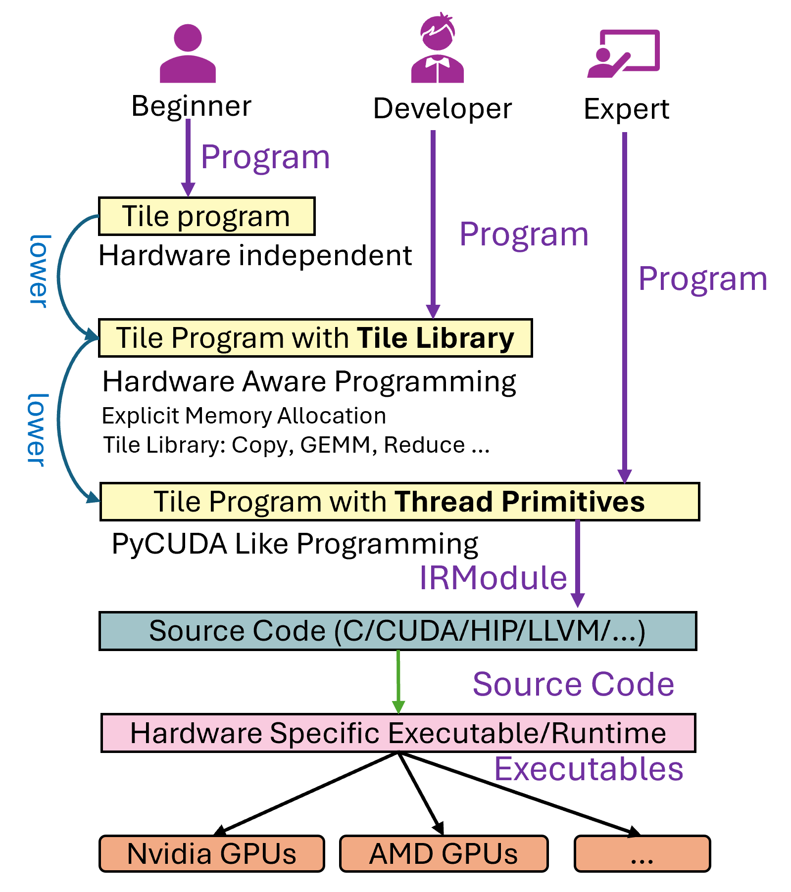
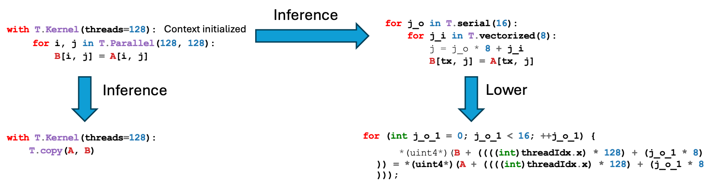

=====================================
Debugging Tile Language Programs
=====================================

.. raw:: html

   

       <em>Author:</em> <a href="https://github.com/LeiWang1999">Lei Wang</a>
   

Overview
--------

A Tile Language program (hereafter referred to as a *program*) is transformed into a hardware-executable file through several stages:

1. The user writes a Tile Language program.
2. The program undergoes multiple *Passes* for transformation and optimization (the *lower* stage, see ``tilelang/engine/lower.py``), finally producing an intermediate representation (e.g., LLVM or C for CPU, CUDA for NVIDIA GPUs, etc.).
3. The generated code is compiled by the respective compiler (e.g., nvcc) into a hardware-executable file.

During this process, users may encounter roughly three categories of issues:

* **Generation issues**: The Tile Language program fails to generate a valid hardware-executable file (i.e., errors during the lowering process).
* **Correctness issues**: The resulting executable runs, but produces incorrect results.
* **Performance issues**: The executable runs with performance significantly below the expected theoretical hardware limits.

This tutorial focuses on the first two issues—how to debug generation and correctness problems. Performance tuning often requires using vendor-provided profiling tools (e.g., **Nsight Compute**, **rocProf**, etc.) for further hardware-level analysis, which we will address in future materials.

Below, we take matrix multiplication (GEMM) as an example to demonstrate how to write and debug a Tile Language program.

Matrix Multiplication Example
-----------------------------

In **Tile Language**, you can use the **Tile Library** to implement matrix multiplication. The following is a complete example:

.. code-block:: python

   import tilelang
   import tilelang.language as T

   def matmul(M, N, K, block_M, block_N, block_K, dtype="float16", accum_dtype="float"):
       @T.prim_func
       def main(
           A: T.Buffer((M, K), dtype),
           B: T.Buffer((K, N), dtype),
           C: T.Buffer((M, N), dtype),
       ):
           # Initialize Kernel Context
           with T.Kernel(T.ceildiv(N, block_N), T.ceildiv(M, block_M), threads=128) as (bx, by):
               A_shared = T.alloc_shared((block_M, block_K), dtype)
               B_shared = T.alloc_shared((block_K, block_N), dtype)
               C_local  = T.alloc_fragment((block_M, block_N), accum_dtype)

               T.clear(C_local)

               for ko in T.Pipelined(T.ceildiv(K, block_K), num_stages=3):
                   # Copy tile of A
                   T.copy(A[by * block_M, ko * block_K], A_shared)

                   # Demonstrate parallelized copy from global to shared for B
                   for k, j in T.Parallel(block_K, block_N):
                       B_shared[k, j] = B[ko * block_K + k, bx * block_N + j]

                   # Perform a tile-level GEMM on the shared buffers
                   T.gemm(A_shared, B_shared, C_local)

               # Copy result back to global memory
               T.copy(C_local, C[by * block_M, bx * block_N])

       return main

   # 1. Define the kernel (matmul) with the desired dimensions
   func = matmul(1024, 1024, 1024, 128, 128, 32)

   # 2. Compile the kernel into a torch function
   jit_kernel = tilelang.JITKernel(func, out_idx=[2], target="cuda")

   # 3. Test the kernel in Python with PyTorch data
   import torch

   a = torch.randn(1024, 1024, device="cuda", dtype=torch.float16)
   b = torch.randn(1024, 1024, device="cuda", dtype=torch.float16)

   # Run the kernel
   c = jit_kernel(a, b)

Debugging Generation Issues
---------------------------

TileLang essentially performs *progressive lowering*. For example, a ``T.copy`` may first be expanded into ``T.Parallel`` (see the pass ``LowerTileOP``), which is then expanded again, eventually resulting in lower-level statements that can be translated to CUDA C code.

When the code fails to generate (for instance, a compilation error occurs), you do **not** necessarily need to jump directly into C++ passes to debug. Instead, you can first inspect the intermediate representations (IR) in Python by printing them. For example, consider a case where a simple ``T.copy`` in 1D causes the lowering process to fail. The snippet below illustrates a simplified version of the problem (based on community Issue #35):

.. code-block:: python

   @T.prim_func
   def main(Q: T.Buffer(shape_q, dtype)):
       with T.Kernel(T.ceildiv(seqlen_q, block_M), heads * batch, num_split, threads=128 * 2) as (bx, by, bz):
           Q_shared = T.alloc_shared([block_M, dim], dtype)
           T.copy(Q[bid, 0, hid, :], Q_shared[0, :])

The TileLang lower process might yield an error such as:

.. code-block:: text

   File "/root/TileLang/src/target/codegen_cuda.cc", line 1257
   ValueError: Check failed: lanes <= 4 (8 vs. 4) : Ramp of more than 4 lanes is not allowed.

This indicates that somewhere during code generation, an unsupported vectorization pattern was introduced (a ramp of 8 lanes). Before diving into the underlying C++ code, it is helpful to print the IR right before code generation. For instance:

.. code-block:: python

   device_mod = tir.transform.Filter(is_device_call)(mod)
   device_mod = tir.transform.LowerDeviceStorageAccessInfo()(device_mod)
   device_mod = tir.transform.LowerIntrin()(device_mod)
   device_mod = tir.transform.Simplify()(device_mod)
   print(device_mod)

   if target.kind.name == "cuda":
       device_mod = tvm._ffi.get_global_func("target.build.tilelang_cuda")(device_mod, target)

By examining the printed IR, you may see how the index calculations expand incorrectly, revealing which pass is handling the special case improperly. You can then fix or refine that pass to address the code generation problem.

Debugging Correctness Issues
----------------------------

Sometimes, the kernel compiles and runs but produces incorrect results. In such cases, there are two main strategies to help debug:

1. **Use post-processing callbacks to inspect or modify the generated CUDA code.**
2. **Use the built-in ``T.print`` debugging primitive to inspect values at runtime.**

Post-Processing Callbacks for Generated Source
~~~~~~~~~~~~~~~~~~~~~~~~~~~~~~~~~~~~~~~~~~~~~~

After code generation (in the codegen pass), TileLang calls a callback function (if registered) to allow post-processing of the generated source code. In ``src/target/rt_mod_cuda.cc``:

.. code-block:: cpp

   std::string code = cg.Finish();
   if (const auto *f = Registry::Get("tilelang_callback_cuda_postproc")) {
       code = (*f)(code, target).operator std::string();
   }

Hence, by registering a Python function named ``tilelang_callback_cuda_postproc``, you can intercept the final CUDA code string. For example:

.. code-block:: python

   import tilelang
   import tilelang.language as T
   from tilelang import tvm

   @tvm.register_func
   def tilelang_callback_cuda_postproc(code, _):
       # Example: Insert a comment or print the final CUDA code
       code = "// Debugging Post-Process\n" + code
       print(code)
       return code

   def matmul(M, N, K, block_M, block_N, block_K, dtype="float16", accum_dtype="float"):
       @T.prim_func
       def main(A: T.Buffer((M, K), dtype),
                B: T.Buffer((K, N), dtype),
                C: T.Buffer((M, N), dtype)):
           with T.Kernel(T.ceildiv(N, block_N), T.ceildiv(M, block_M), threads=128) as (bx, by):
               A_shared = T.alloc_shared((block_M, block_K), dtype)
               B_shared = T.alloc_shared((block_K, block_N), dtype)
               C_local  = T.alloc_fragment((block_M, block_N), accum_dtype)

               T.clear(C_local)
               for ko in T.Pipelined(T.ceildiv(K, block_K), num_stages=3):
                   T.copy(A[by * block_M, ko * block_K], A_shared)
                   for k, j in T.Parallel(block_K, block_N):
                       B_shared[k, j] = B[ko * block_K + k, bx * block_N + j]
                   T.gemm(A_shared, B_shared, C_local)
               T.copy(C_local, C[by * block_M, bx * block_N])

       return main

   # Instantiate and compile
   func = matmul(1024, 1024, 1024, 128, 128, 32)
   jit_kernel = tilelang.JITKernel(func, out_idx=[2], target="cuda")

Using this callback, you can insert debugging statements or simply print out the generated CUDA source to verify the correctness of generated indexing and logic before the kernel is compiled.

Runtime Debug Prints with ``T.print``
~~~~~~~~~~~~~~~~~~~~~~~~~~~~~~~~~~~~~

TileLang provides a built-in debugging primitive called ``T.print`` for printing within kernels. Be mindful of concurrency and thread synchronization when using it in GPU code. Below are some examples showing how to print buffers, variables, and other data inside TileLang programs. These examples can be found in the TileLang codebase (e.g., ``testing/python/debug/test_tilelang_debug_print.py``).

1. **Printing an Entire Buffer**

   .. code-block:: python

      def debug_print_buffer(M=16, N=16):
          dtype = "float16"

          @T.prim_func
          def program(Q: T.Buffer((M, N), dtype)):
              with T.Kernel(4, 4, 2, threads=128 * 2) as (bx, by, bz):
                  shared_buf = T.alloc_shared([M, N], dtype)
                  # Print the entire shared_buf
                  T.print(shared_buf)

          jit_kernel = tilelang.JITKernel(program, target="cuda")
          profiler = jit_kernel.get_profiler()
          profiler.run_once()

   This will print all elements in ``shared_buf`` to stdout. Note that in GPU kernels with many threads, outputs can interleave.

2. **Conditional Printing**

   You can limit print output to reduce noise. For instance, only print when ``bx == 0 and by == 0 and bz == 0``:

   .. code-block:: python

      def debug_print_buffer_conditional(M=16, N=16):
          dtype = "float16"

          @T.prim_func
          def program(Q: T.Buffer((M, N), dtype)):
              with T.Kernel(4, 4, 2, threads=128 * 2) as (bx, by, bz):
                  shared_buf = T.alloc_shared([M, N], dtype)
                  if bx == 0 and by == 0 and bz == 0:
                      T.print(shared_buf)

          jit_kernel = tilelang.JITKernel(program, target="cuda")
          profiler = jit_kernel.get_profiler()
          profiler.run_once()

3. **Printing Thread Indices or Scalar Values**

   .. code-block:: python

      def debug_print_value_conditional(M=16, N=16):
          dtype = "float16"

          @T.prim_func
          def program(Q: T.Buffer((M, N), dtype)):
              with T.Kernel(4, 4, 2, threads=128 * 2) as (bx, by, bz):
                  # Retrieve thread ID
                  tid = T.get_thread_binding()
                  if tid == 0:
                      # Print bx+by+bz only from one thread
                      T.print(bx + by + bz)

          jit_kernel = tilelang.JITKernel(program, target="cuda")
          profiler = jit_kernel.get_profiler()
          profiler.run_once()

4. **Printing Fragment (Register File) Contents**

   If you use ``T.alloc_fragment(...)`` (for example, warp-level matrix fragments), you can still print the data:

   .. code-block:: python

      def debug_print_register_files(M=16, N=16):
          dtype = "float16"

          @T.prim_func
          def program(Q: T.Buffer((M, N), dtype)):
              with T.Kernel(4, 4, 2, threads=128 * 2) as (bx, by, bz):
                  register_buf = T.alloc_fragment([M, N], dtype)
                  # Parallel iteration with printing
                  for i, j in T.Parallel(M, N):
                      T.print(register_buf[i, j])

          jit_kernel = tilelang.JITKernel(program, target="cuda")
          profiler = jit_kernel.get_profiler()
          profiler.run_once()

5. **Adding a Message Prefix**

   You can supply a message prefix to distinguish prints:

   .. code-block:: python

      def debug_print_msg(M=16, N=16):
          dtype = "float16"

          @T.prim_func
          def program(Q: T.Buffer((M, N), dtype)):
              with T.Kernel(4, 4, 2, threads=128 * 2) as (bx, by, bz):
                  tid = T.get_thread_binding()
                  if tid == 0:
                      T.print(bx + by + bz, msg="hello world")

          jit_kernel = tilelang.JITKernel(program, target="cuda")
          profiler = jit_kernel.get_profiler()
          profiler.run_once()

   The output messages will include something like:

   .. code-block:: text

      msg='hello world' BlockIdx=(0, 0, 0), ThreadIdx=(0, 0, 0): 0

Conclusion
----------

By carefully examining intermediate representations (IR) before final code generation—and by leveraging runtime printing through ``T.print``—one can quickly diagnose where index calculations, copy logic, or other kernel operations deviate from the intended behavior. This two-pronged approach (inspecting IR transformations and using runtime prints) is often sufficient for resolving generation and correctness issues in TileLang programs.

For advanced performance tuning (e.g., analyzing memory bandwidth or occupancy), more specialized profiling tools such as **Nsight Compute**, **rocProf**, or vendor-specific profilers may be required. Those aspects will be covered in future documents.