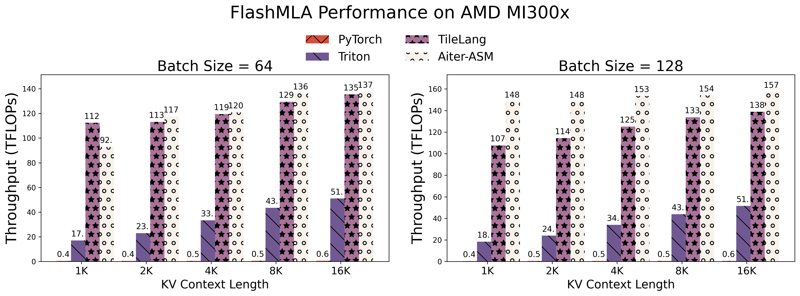

# 🚀 High-Performance FlashMLA Implementation Using TileLang on AMD MI300X Accelerators

Following our previous demonstration of [high-performance FlashMLA implementation on NVIDIA Hopper architectures using TileLang](https://github.com/tile-ai/tilelang/blob/main/examples/deepseek_mla/README.md), this work presents an optimized implementation for AMD MI300X accelerators. We examine architectural differences and corresponding optimization strategies between these platforms.

## Architectural Considerations and Optimization Strategies

Key implementation differences between Hopper and MI300X architectures include:

1. **Instruction Set Variations**: The MI300X architecture eliminates the need for explicit Tensor Memory Access (TMA) instructions and warp specialization, which are automatically handled by the compiler on Hopper architectures, resulting in identical source code manifestations.

2. **Shared Memory Constraints**: With 64KB of shared memory compared to Hopper's 228KB, MI300X implementations require careful memory management. Our optimization strategy includes:
   - Reducing software pipeline stages
   - Register-based caching of Q matrices instead of shared memory utilization:
   ```python
   # Original shared memory allocation
   Q_shared = T.alloc_shared([block_H, dim], dtype)
   Q_pe_shared = T.alloc_shared([block_H, pe_dim], dtype)
   
   # Optimized register allocation
   Q_local = T.alloc_fragment([block_H, dim], dtype)
   Q_pe_local = T.alloc_fragment([block_H, pe_dim], dtype)
   ```

3. **Tile Size Flexibility**: The absence of WGMMA instructions on MI300X permits more flexible tile size selection, removing the requirement for block_m to be multiples of 64.

4. **Memory Bank Conflict Swizzling**: MI300x has different memory bank conflict rules compared to NVIDIA, so we need to use different swizzling strategies. This is also automatically handled by TileLang, resulting in no visible differences in the code.

## Performance Evaluation

We conducted comparative performance analysis across multiple frameworks using float16 precision with batch sizes 64 and 128. The experimental results demonstrate:

<figure style="text-align: center">
  <a href="../figures/flashmla-amd.png">
    
   </a>
  <figcaption style="text-align: center;">Figure 1: Computational throughput comparison across frameworks (Batch sizes 64 and 128)</figcaption>
</figure>

Notably, TileLang achieves performance parity with hand-optimized assembly kernels (aiter-asm) in most test cases, while significantly outperforming both Triton (1.98×) and PyTorch (3.76×) implementations. This performance is achieved through a concise 80-line Python implementation, demonstrating TileLang's efficiency and programmability advantages.

## Future Optimization Opportunities

1. **Memory Bank Conflict Mitigation**: Current implementations primarily address bank conflicts in NT layouts through TileLang's automatic optimization. Further investigation of swizzling techniques for alternative memory layouts remains an open research direction.

2. **Dimension Parallelization**: For large MLA dimensions (e.g., 576 elements), we propose investigating head dimension partitioning strategies to:
   - Reduce shared memory pressure
   - Improve compute-to-memory access ratios
   - Enhance parallelism through dimension-wise task distribution
