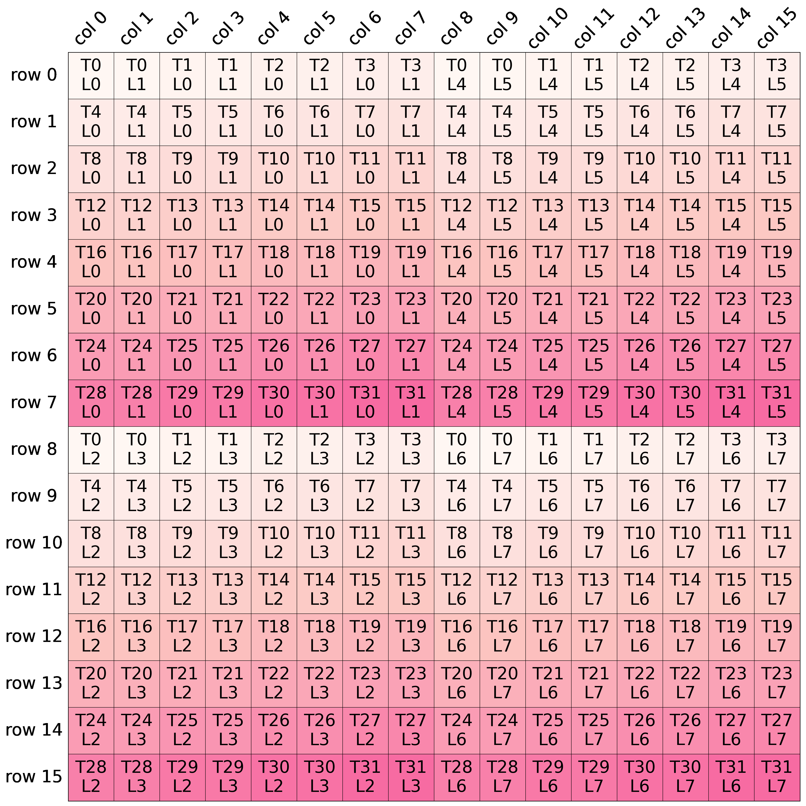

The following example demonstrates how to generate and visualize a memory layout using tilelang tools `plot_layout`.

Example Code

```python
from tilelang.tools import plot_layout
from tilelang.layouts import make_mma_load_base_layout  # Ensure this function is imported

# Create a 16×16 matrix layout for ldmatrix operations
base_layout = make_mma_load_base_layout(dtype="float16", matrix="A", transposed=False)

# Print the layout structure (optional for debugging)
print(base_layout)

# Plot and save the layout visualization
plot_layout(base_layout, name="base_layout")
```

Output


